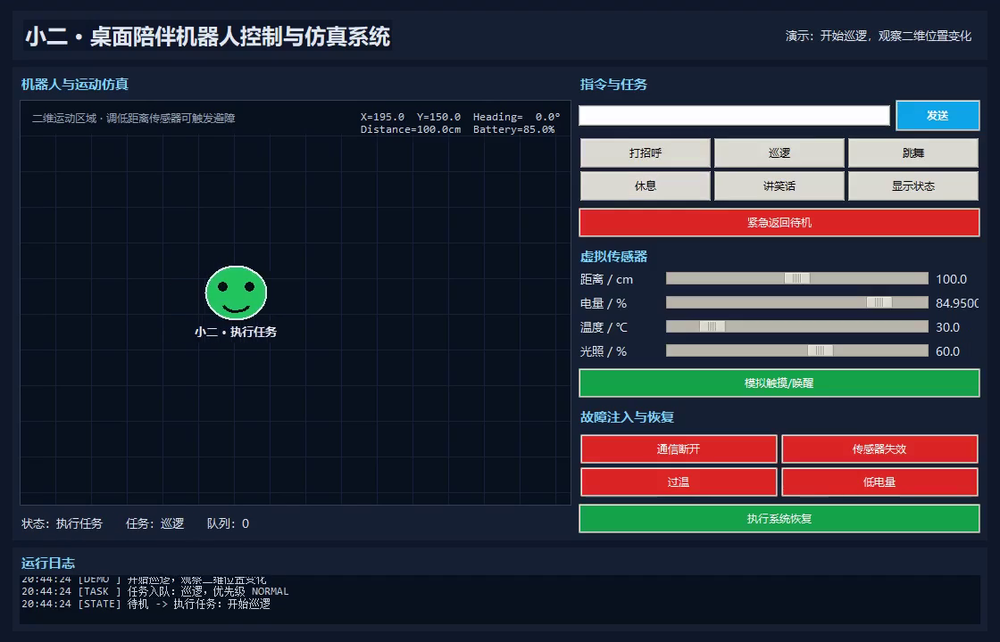

# 小二 - 桌面陪伴机器人控制与仿真系统

一个完全不依赖实体硬件的桌面机器人软件项目。项目使用 Python 标准库和
Tkinter 实现机器人动画、行为状态机、优先级任务队列、虚拟传感器、二维运动、
故障注入、异常恢复和自动化测试。



演示视频：[`demo_xiaoer_robot_60s.mp4`](demo_xiaoer_robot_60s.mp4)

## 功能

- 8 种状态：启动、待机、交互、执行任务、避障、低电量、休眠、故障
- 6 类任务：打招呼、巡逻、跳舞、休息、讲笑话、显示状态
- 带优先级的任务队列和紧急任务抢占
- 距离、电量、温度、光照、触摸、通信状态等虚拟输入
- 二维位置、方向、速度及边界碰撞仿真
- 障碍物检测、低电量保护、过温保护、通信超时和传感器失效处理
- 故障注入、系统恢复和可追溯运行日志
- 自定义二进制通信协议、CRC16、流式拆包/粘包解析和错误统计
- 协议网关：传感器更新、远程任务控制、重复序号过滤和状态回传
- TCP虚拟设备与演示客户端，可进行无硬件真实Socket联调
- 51 项自动化测试（控制器、协议、网关、通信服务、TCP及10000帧压力测试）
- GitHub Actions 在 Windows/Linux 和多个 Python 版本上持续验证

## 通信协议

新增面向 UART DMA 数据流的纯软件协议层，帧格式为：

```text
AA 55 | Version | Command | Sequence | PayloadLength | Payload | CRC16-Modbus
```

- 最大 Payload 为 128 字节，内部流缓冲区上限为 512 字节
- 支持心跳、传感器数据、控制指令和设备状态 4 类命令
- 支持逐字节拆包、多帧粘包、随机噪声及 Payload 内伪帧头
- CRC、版本、长度和未知命令错误分别计数
- 半帧超过 100 ms 未完成时复位解析状态
- 错帧后重新同步下一帧，不清空后续合法数据
- 10000 帧确定性随机分块压力测试全部通过
- 通信服务统一处理分块接收、链路超时、断线恢复和状态回传
- 仅接受合法业务帧或其重复重传作为链路存活依据，非法Payload不能掩盖通信超时

详细帧格式、Payload和错误恢复规则见 [`docs/protocol.md`](docs/protocol.md)。

## TCP联调演示

先双击 `run_virtual_device.bat` 启动虚拟设备，再双击 `run_tcp_demo.bat`。客户端会将
心跳、传感器和巡逻指令经过真实TCP字节流发送给机器人，并接收3帧设备状态响应。
详细步骤见 [`docs/tcp_demo.md`](docs/tcp_demo.md)。

服务端使用互斥锁串行化网络线程对控制器的访问，并通过并发客户端测试验证多连接
同时下发任务时不会破坏任务队列；默认最多允许8个并发连接，超额连接会被拒绝并计数。

## 架构

```text
任意长度字节块（模拟UART DMA）
             ↓
StreamParser：拆包/粘包/CRC/重同步/统计
             ↓
ProtocolGateway：Payload校验/去重/命令映射
             ↓
CommunicationService：链路状态/超时/收发闭环
             ↓
RobotController：状态机/任务队列/保护与恢复
             ↓
Tkinter GUI：显示、交互和自动演示
```

## 运行环境

- Windows 10/11
- Python 3.10 或更高版本
- Tkinter（Windows 官方 Python 通常自带）
- 不需要任何第三方 Python 包

## 启动

双击：

```text
run_robot.bat
```

或在项目目录执行：

```bash
python main.py
```

运行约1分钟自动演示：

```bash
python main.py --demo
```

## 测试

双击 `run_tests.bat`，或执行：

```bash
python -m unittest discover -s tests -v
```

## 操作方式

1. 点击“巡逻”观察机器人移动。
2. 将距离滑块调到 20 cm 以下，观察机器人进入避障状态。
3. 点击“通信断开”或“传感器失效”，连续检测后进入故障状态。
4. 点击“执行系统恢复”，清除异常并回到待机状态。
5. 在指令框输入“你好、巡逻、跳舞、休息、讲笑话、状态、唤醒、复位”。
6. 普通任务执行期间点击“紧急返回待机”，观察任务抢占。

## 项目结构

```text
desktop_robot_simulator/
├─ main.py
├─ virtual_device.py
├─ tcp_demo_client.py
├─ run_robot.bat
├─ run_tests.bat
├─ run_virtual_device.bat
├─ run_tcp_demo.bat
├─ requirements.txt
├─ README.md
├─ RESUME.md
├─ robot_sim/
│  ├─ __init__.py
│  ├─ models.py
│  ├─ protocol.py
│  ├─ gateway.py
│  ├─ communication.py
│  ├─ tcp_transport.py
│  ├─ controller.py
│  └─ ui.py
├─ docs/
│  ├─ protocol.md
│  └─ tcp_demo.md
└─ tests/
   ├─ test_communication.py
   ├─ test_controller.py
   ├─ test_protocol.py
   ├─ test_tcp_transport.py
   └─ test_gateway.py
```

## 设计说明

控制器与 GUI 分离。`RobotController` 不依赖 Tkinter，因此状态机、任务队列、
故障检测和恢复逻辑可以独立测试。GUI 每 100 ms 调用一次 `tick()`，相当于
嵌入式系统中的周期任务。

状态机限制非法跳转；任务队列使用优先级堆实现；连续通信或传感器异常达到阈值
后进入故障状态；恢复动作统一清除异常计数并恢复安全参数。

通信解析器与 GUI、控制器解耦，通过 `feed()` 接收任意长度的数据块，模拟 UART
DMA 每次产生不同长度数据的情况。解析器只输出 CRC、版本、长度和命令均合法的
完整帧，并通过统计结构保留错误与丢弃数据的诊断信息。

## 后续扩展

- 使用 SQLite 保存历史运行记录
- 添加 TCP/UDP 虚拟设备通信
- 使用 JSON 配置任务和传感器阈值
- 增加语音识别或本地自然语言命令
- 使用 PyInstaller 打包为 Windows EXE
